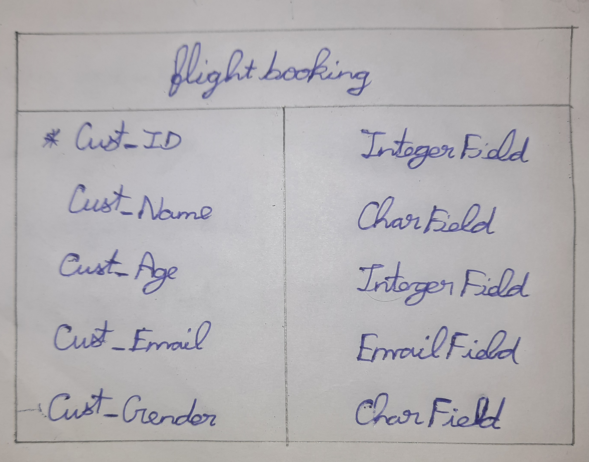

# Django ORM Web Application

## AIM
To develop a Django application to store and retrieve data from a database using Object Relational Mapping(ORM).

## Entity Relationship Diagram


## DESIGN STEPS

### STEP 1:
Clone the repository to theia ide. Start a new app inside the project folder.

### STEP 2:
Type the appropriate code for your table and provide approproate data types to the columns.

### STEP 3:
Create a report about your project in readme.md file and upload the django.orm.app folder to your remote repository

## PROGRAM

```
from django.db import models
from django.contrib import admin
class Flightbooking(models.Model):
    Cust_ID = models.IntegerField(primary_key=True)
    Cust_Name = models.CharField(max_length=100)
    Cust_Age = models.IntegerField()
    Cust_Email = models.EmailField()
    Cust_Gender = models.CharField(max_length=100)

class FlightbookingAdmin(admin.ModelAdmin):
    list_display = ('Cust_ID','Cust_Name','Cust_Age','Cust_Email','Cust_Gender')
```

## OUTPUT


## RESULT
hence we developed a Django application to store and retrieve data from a database using Object Relational Mapping(ORM).
